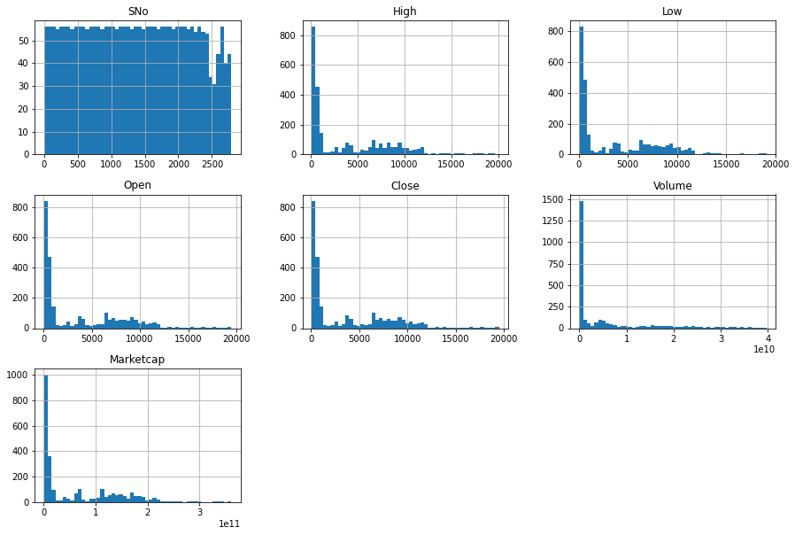
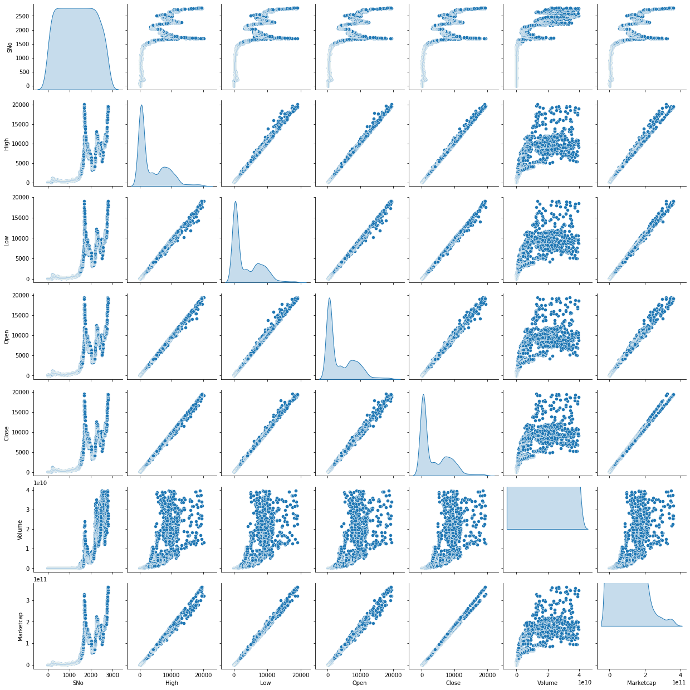
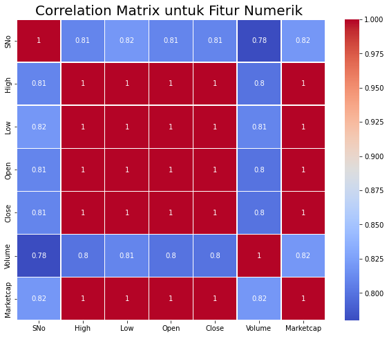
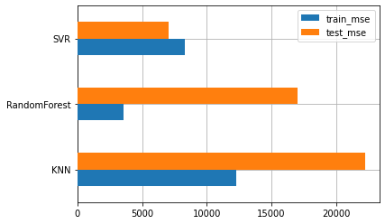
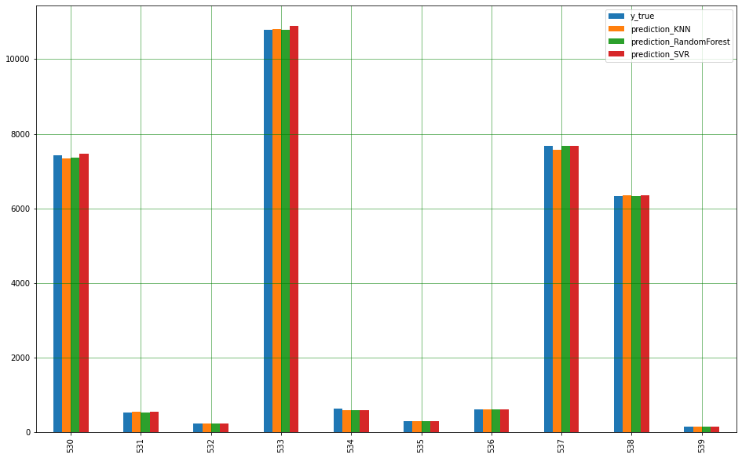

# Laporan Proyek Pertama

### Aldo Valentino | M180X0298

## Domain Proyek
### Latar Belakang
Selama bertahun-tahun prediksi harga pasar telah menarik dan menantang investor serta peneliti, karena banyak ketidakpastian yang terlibat dan banyak variabel yang mempengaruhi pasar. Beberapa tahun terakhir, pasar tidak hanya tentang saham tetapi juga mata uang digital atau cryptocurrency. Cryptocurrency merupakan mata uang digital yang transaksinya dapat dilakukan menggunakan jaringan internet.

Saat ini telah banyak jenis mata uang kripto dan salah satu yang sedang terkenal saat ini adalah Bitcoin. Bitcoin adalah sebuah uang elektronik yang dibuat pada tahun 2009 oleh Satoshi Nakamoto. Nama tersebut juga dikaitkan dengan perangkat lunak sumber terbuka yang dia rancang, dan juga menggunakan jaringan peer-to-peer tanpa penyimpanan terpusat atau administrator tunggal di mana Departemen Keuangan Amerika Serikat menyebut bitcoin sebuah mata uang yang terdesentralisasi. Bitcoin dan pasar cryptocurrency lainnya dapat diperdagangkan setiap saat karena tidak memiliki periode tutup, inilah yang membedakannya dengan pasar lainnya. Bitcoin lebih mudah berubah dan berisiko bagi para pedagang. Faktor ketidakpastian yang ada, perlu dikurangi oleh para pedagang untuk meminimalkan risiko. Salah satu cara yang digunakan untuk melakukan hal tersebut adalah prediksi harga Bitcoin secara akurat.

Saat melakukan prediksi, di perlukan metode yang tepat. Salah satunya adalah dengan menerapkan machine learning. Machine Learning adalah cabang dari kecerdasan buatan (AI) dan ilmu komputer yang berfokus pada penggunaan data dan algoritma untuk meniru cara manusia belajar. Penerapan machine learning membantu dalam proses analisis data besar dan kompleks, sehingga tugas bisa diselesaikan dengan cepat.

Berdasarkan hal tersebut, maka dilakukan penelitian tentang prediksi harga Bitcoin menggunakan machine learning. Proyek machine learning ini di buat agar dapat memprediksi harga pasar Bitcoin di masa mendatang. Dengan penerapan machine learning di harapkan dapat mengurangi tingkat kerugian akibat harga mata uang Bitcoin yang tidak stabil.

Referensi:
**[Prediksi Harga Bitcoin Menggunakan Metode Random Forest](https://www.google.com/url?sa=t&rct=j&q=&esrc=s&source=web&cd=&cad=rja&uact=8&ved=2ahUKEwiyxMj02837AhVrCbcAHV6VDQIQFnoECAsQAQ&url=https%3A%2F%2Fjurnal.pcr.ac.id%2Findex.php%2Fjkt%2Farticle%2Fview%2F4618&usg=AOvVaw2Z2ESU2B8DaG9eDK-2PBJJ)**.

## Business Understanding
### Problem Statement
Berdasarkan pada latar belakang di atas, permasalahan yang dapat diselesaikan pada proyek ini adalah sebagai berikut:

- Bagaimana cara menganalisa data harga mata uang Kripto?
- Bagaimana cara memproses data harga mata uang Bitcoin sehingga dapat di latih dengan baik oleh model?
- Bagaimana cara membangun model machine learning yang dapat memprediksi harga dengan baik?
  
### Goals
Tujuan dibuatnya proyek ini adalah sebagai berikut:

- Mendapatkan analisa yang cukup untuk memahami data Harga mata uang kripto.
- Melakukan persiapan pada data agar dapat dengan mudah di mengerti oleh model.
- Membuat model machine learning yang dapat memahami pola pada data dengan baik.
- Dapat memprediksi harga dengan akurat.

## Data Understanding
Dataset yang di gunakan pada proyek machine learning ini merupakan dataset riwayat harga mata uang Bitcoin dari waktu ke waktu. Dataset tersebut dapat di unduh di website kaggle: **[Cryptocurrency Historical Prices (Bitcoin)](https://www.kaggle.com/datasets/sudalairajkumar/cryptocurrencypricehistory?select=coin_Bitcoin.csv)**.

### Variabel-variabel pada dataset adalah sebagai berikut :
- Name: Nama mata uang kripto
- Symbol: Simbol mata uang kripto
- Date: Tanggal pencatatan data
- High : Harga tertinggi pada hari tertentu
- Low : Harga terendah pada hari tertentu
- Open : Harga pembukaan pada hari tertentu
- Close : Harga penutupan pada hari tertentu
- Volume : Volume transaksi pada hari tertentu
- Mastercap : Kapitalisasi pasar dalam USD

Sebelum melakukan pemrosesan data untuk pelatihan, perlu dilakukan analisa pada data untuk mengetahui keadaan pada data seperti korelasi antar fitur dan outlier pada data. Berikut visualisasi data yang menunjukkan korelasi atar fitur dan outlier pada data:
- Menangani Outlier
  Jika dilihat divisualisasi outlier dibawah hampir semua data numeric memiliki data outlier. Terdapat beberapa teknik untuk mengatasi outlier pada data. Pada proyek ini akan menerapkan teknik IQR Method yaitu dengan menghapus data yang berada diluar interquartile range. Interquartile merupakan range diantara kuartil pertama(25%) dan kuartil ketiga(75%).
  
- Univariate Analysis
  Karena target prediksi dari dataset ini ada pada fitur Close_Price yang merupakan harga crypto coin Bitcoin, jadi hanya fokus menganalisis korelasi data pada feature tersebut. Dari hasil visualisasi data dibawah dapat disimpulkan bahwa peningkatan harga crypto coin Bitcoin sebanding dengan penurunan jumlah sampel data.
  
- Multivariate Analysis
  Jika di lihat dari visualisasi data dibawah. Fitur Close pada sumbu y memiliki korelasi dengan data pada fitur High, Low, Open, dan Marketcap. Korelasi yang terdapat pada data-data tersebut merupakan korelas yang tinggi, sedangkan untuk fitur Volume terlihat memiliki korelasi yang cukup lemah karena sebaran datanya tidak membentuk pola.
  

Untuk lebih jelasnya dapat dilihat melalui visualisasi dibawah yang menunjukkan skor korelasi di tiap fitur dengan fitur Close. Pada fitur High, Low, Open dan Marketcap memiliki skor korelasi yang terbilang tinggi yaitu 1. Sedangkan pada fitur Volume memiliki skor korelasi yang cukup rendah yaitu 0.78. Sehingga fitur Volume ini dapat didrop dari dataset.

## Data Preparation

### Menghapus data yang tidak diperlukan dan merubah nama column

Kolom data seperti (SNo, Name, Symbol, Date, Marketcap) tidak diperlukan untuk pelatihan, karena data tersebut akan mengganggu model dalam mempelajari data. Karena isi dari data tersebut tidak memiliki value yang berarti untuk dipelajari oleh model. Lalu, mengubah nama kolom High, Low, Open, Close menjadi nama kolom yang dapat lebih dipahami.

### Split Dataset

Membagi dataset menjadi data latih (train) dan data uji (test) merupakan hal yang harus kita lakukan sebelum membuat model.Data latih adalah sekumpulan data yang akan digunakan oleh model untuk melakukan pelatihan. Sedangkan, data uji adalah sekumpulan data yang akan digunakan untuk memvalidasi kinerja pada model yang telah dilatih. Karena data uji berperan sebagai data baru yang belum pernah dilihat oleh model, maka cara ini efektif untuk memeriksa performa model setelah proses pelatihan dilakukan. Proporsi pembagian dataset pada proyek ini menggunakan proporsi pembagian 90:10 yang berarti sebanyak 90% merupakan data latih dan 10% persen merupakan data uji.

### Normalisasi Data

Melakukan transformasi pada data fitur fitur yang akan dipelajari oleh model menggunakan library MinMaxScaler. MinMaxScaler mentransformasikan fitur dengan menskalakan setiap fitur ke rentang tertentu. Library ini menskalakan dan mentransformasikan setiap fitur secara individual sehingga berada dalam rentang yang diberikan pada set pelatihan, pada library ini memiliki range default antara 0 dan 1. Dengan merenapkan teknik normalisasi data, model akan dengan lebih mudah mengenali pola-pola yang terdapat pada data sehingga akan menghasilkan prediksi yang lebih baik daripada tidak menggunakan teknik normalisasi.

## Modeling
Algoritma machine learning yang digunakan pada proyek ini yaitu Support Vector Regression, K-Nearest Neighbours, Random Forest.

### Support Vector Regression
Support Vector Regression (SVR) menggunakan prinsip yang sama dengan SVM pada kasus klasifikasi. Perbedaannya adalah jika pada kasus klasifikasi, SVM berusaha mencari ‘jalan’ terbesar yang bisa memisahkan sampel-sampel dari kelas berbeda, maka pada kasus regresi SVR berusaha mencari jalan yang dapat menampung sebanyak mungkin sampel di ‘jalan’. Pada pembuatan model ini dilakukan dengan menggunakan modul yang tersedia di library scikit-learn dengan menggunakan beberapa parameter sebagai berikut:
- `kernel` = rbf. Parameter ini merupakan metode yang digunakan untuk mengambil data sebagai input dan mengubahnya menjadi bentuk pemrosesan data yang diperlukan.
- `gamma` = 0.003. Secara intuitif, parameter gamma menentukan seberapa jauh pengaruh satu contoh pelatihan mencapai, dengan nilai rendah berarti 'jauh' dan nilai tinggi berarti 'dekat'. Parameter gamma dapat dilihat sebagai kebalikan dari radius pengaruh sampel yang dipilih oleh model sebagai vektor pendukung.
- `C` (parameter Regularisasi) = 100000. Parameter C menukar klasifikasi yang benar dari contoh pelatihan terhadap maksimalisasi margin fungsi keputusan. Untuk nilai C yang lebih besar, margin yang lebih kecil akan diterima jika fungsi keputusan lebih baik dalam mengklasifikasikan semua titik pelatihan dengan benar. C yang lebih rendah akan mendorong margin yang lebih besar, oleh karena itu fungsi keputusan yang lebih sederhana, dengan mengorbankan akurasi pelatihan. Dengan kata lain C berperilaku sebagai parameter regularisasi dalam SVR.

Pada tahap ini model akan melakukan pelatihan terhadap data latih untuk mendapatkan error seminimal mungkin, kemudian setelah pelatihan model melakukan prediksi terhadap data yang belum pernah di lihat sebelumnya menggunakan data uji. Namun algoritma ini memiliki keunggulan dan kekurangan.

Berikut keunggulan Support Vector Machine:

- SVR efektif pada data berdimensi tinggi (data dengan jumlah fitur atau atribut yang sangat banyak).
- SVR efektif pada kasus di mana jumlah fitur pada data lebih besar dari jumlah sampel.
- SVR menggunakan subset poin pelatihan dalam fungsi keputusan (disebut support vector) sehingga membuat penggunaan memori menjadi lebih efisien.
  
Berikut kelemahan Support Vector Machine:

- Sulit dipakai dalam problem berskala besar. Skala besar dalam hal ini dimaksudkan dengan jumlah sample yang diolah.

### K-Nearest Neighbours

K-nearest neighbor adalah salah satu algoritma machine learning dengan pendekatan supervised learning yang bekerja dengan mengkelaskan data baru menggunakan kemiripan antara data baru dengan sejumlah data (k) pada lokasi yang terdekat yang telah tersedia. Algoritma ini menerapkan lazy learning” atau “instant based learning” dan merupakan algoritma non parametrik. Algoritma KNN digunakan untuk klasifikasi dan regresi. Pada pembuatan model ini akan menggunaka modul KNN yang terlah di sediakan oleh library scikit-learn .Pada model ini hanya akan menggunakan 1 parameter yaitu `n_neighbours` (Jumlah tetangga). Jumlah neighbours yang di gunakan yaitu sejumlah 5 neighbours. Kemudian, untuk menentukan titik mana dalam data yang paling mirip dengan input baru, KNN menggunakan perhitungan ukuran jarak. Metrik ukuran jarak yang digunakan secara default pada library sklearn adalah Minkowski distance. Setelah menentukan nilai-nilai pada parameter model melakukan pelatihan menggunakan data latih setelah itu model akan melakukan prediksi terhadap data yang belum pernah dilihat dengan menggunakan data uji. Namun algoritma ini memiliki keunggulan dan kekurangan.

Berikut keunggulan K-Nearest Neighbours:

- Sangat sederhana dan mudah dipahami
- Sangat mudah diterapkan
- Dapat digunakan dalam proses klasifikasi maupun regresi.
- Sangat mudah jika akan dilakukan penambahan data
- Parameter yang diperlukan sedikit, yaitu hanya jumlah tetangga yang dipertimbangkan (K), dan metode perhitungan jaraknya (distance metrik)

Berikut kelemahan K-Nearest Neighbours:

- Perlu menentukan nilai K yang tepat.
- Computation cost yang tinggi
- Waktu pemrosesan yang lama jika datasetnya sangat besar.
- Tidak cukup bagus jika diterapkan pada high dimensional data
- Sangat sensitif pada data yang memiliki banyak noise (noisy data), banyak data yang hilang (missing data), dan pencilan (outliers).

### Random Forest

Algoritma ini merupakan sekumpulan algoritma decision tree. Konsep dasar decision tree adalah mengubah data menjadi aturan-aturan keputusan. Kombinasi dari masing–masing decision tree yang baik kemudian dikombinasikan ke dalam satu model. Random Forest bergantung pada sebuah nilai vector random dengan distribusi yang sama pada semua pohon yang masing masing decision tree memiliki kedalaman yang maksimal. Algoritma ini bisa menyelesaikan permasalahan klasifikasi dan regresi. Pada kasus klasifikasi, prediksi akhir diambil dari prediksi terbanyak pada seluruh pohon. Sedangkan, pada kasus regresi, prediksi akhir adalah rata-rata prediksi seluruh pohon. Untuk pembuatan model Random Forest, akan menggunakan beberapa parameter, antara lain:

- `n_estimator` : jumlah trees (pohon) di forest. Di sini kita set n_estimator=50.
- `max_depth`: kedalaman atau panjang pohon. Ia merupakan ukuran seberapa banyak pohon dapat membelah (splitting) untuk membagi setiap node ke dalam jumlah pengamatan yang diinginkan.

Setelah itu model akan melakukan pelatihan menggunakan data latih, setelah itu model bisa melakukan prediksi pada data yang belum pernah diliath dengan menggunakan data uji. Namun model ini memiliki beberapa keuntungan dan juga kelemahan.

Berikut keunggulan Random Forest:

- Algoritma Random Forest merupakan algoritma dengan pembelajaran paling akurat yang tersedia. Untuk banyak kumpulan data, algoritma ini menghasilkan pengklasifikasi yang sangat akurat.
- Berjalan secara efisien pada data besar.
- Dapat menangani ribuan variabel input tanpa penghapusan variabel.
- Memiliki metode yang efektif untuk memperkirakan data yang hilang dan menjaga akurasi ketika sebagian besar data hilang.

Berikut kelemahan Random Forest:

- Algoritma Random Forest overfiting untuk beberapa kumpulan data dengan tugas klasifikasi/regresi yang bising/noise.
- Untuk data yang menyertakan variabel kategorik dengan jumlah level yang berbeda, Random Forest menjadi bias dalam mendukung atribut dengan level yang lebih banyak. Oleh karena itu, skor kepentingan variabel dari Random Forest tidak dapat diandalkan untuk jenis data ini.

Pada proyek ini yang menjadi model dengan solusi terbaik adalah Support Vector Regression (SVR). Dimana model ini memiliki nilai error paling rendah dari kedua model lainnya dan hasil prediksinya yang paling mendekati dengan angka sebenarnya.

## Evaluation

Pada proyek machine learning ini, metrik evaluasi yang digunakan yaitu _mean squared error (MSE)_ yang mana metrik ini merupakan ukuran seberapa dekat garis pas dengan titik data. Untuk setiap titik data, model mengambil jarak secara vertikal dari titik ke nilai y yang sesuai pada kecocokan kurva (kesalahan), dan kuadratkan nilainya.

dimana:
- At = Nilai Aktual permintaan
- Ft = Nilai hasil prediksi
- n = banyaknya data

Setelah melakukan evaluasi menggunakan metrik _MSE_ pada model dengan menggunakan data uji didapatkan hasil seperti berikut:

Dapat dilihat dari visulisasi di atas bahwa MSE pada model SVR merupakan MSE yang paling rendah dari kedua model lainnya, selain itu jumlah error pada saat pengujian tidak berbeda jauh dengan error pada saat pelatihan.

Dapat juga dilihat melalui visualisasi di atas bahwa angka prediksi pada model SVR yang paling mendekati dengan angka sebenarnya.
